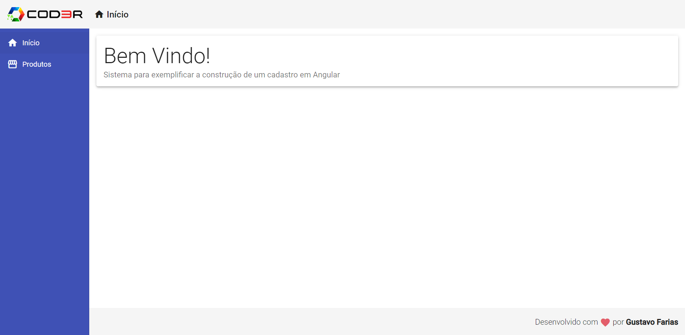
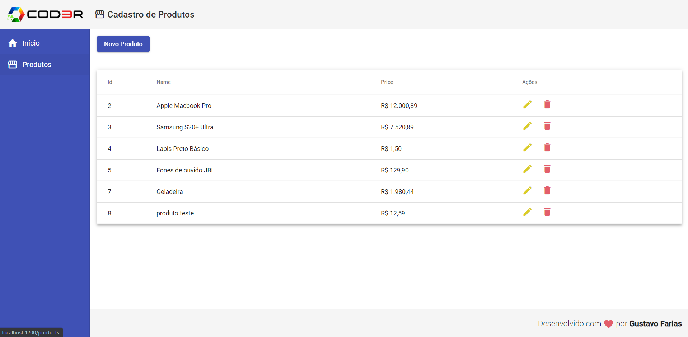

# Angular 9 - CRUD de Gerenciamento de produtos

## 📖 Sobre
CRUD desenvolvido em Angular com o objetivo de aprender os principais conceitos do framework, aplicando em um projeto simples.

## :rocket: Tecnologias
- [Typescript](https://www.typescriptlang.org/)
- [Angular](https://angular.io/)
- [Angular Material](https://material.angular.io/)

## 🔥 Resultado





## 🤔 Como usar

### **Pré-requisitos**
- É **necessário** possuir o **[Node.js](https://nodejs.org/en/)** instalado
- Também, é **preciso** ter um gerenciador de pacotes seja o **[NPM](https://www.npmjs.com/)** ou **[Yarn](https://yarnpkg.com/)**.
- Por fim, é **essencial** ter o **[Angular-cli](https://cli.angular.io/)** instalado de forma global na máquina

1. Faça um clone :

```sh
  $ git clone https://github.com/gustavofsa/crud-angular.git
```

2. Executando a Aplicação:

```sh
  # Instale as dependências no backend e frontend
  $ npm install

  # Inicie a API
  $ npm start

  # Inicie a aplicação web
  $ npm start
  # ou
  $ ng serve
```
3. Navegue para ```http://localhost:4200```

## Créditos
Esse projeto é fruto do curso de Angular 9 - Essencial da Cod3r, mais informações [aqui](https://www.cod3r.com.br/courses/angular-9-essencial).